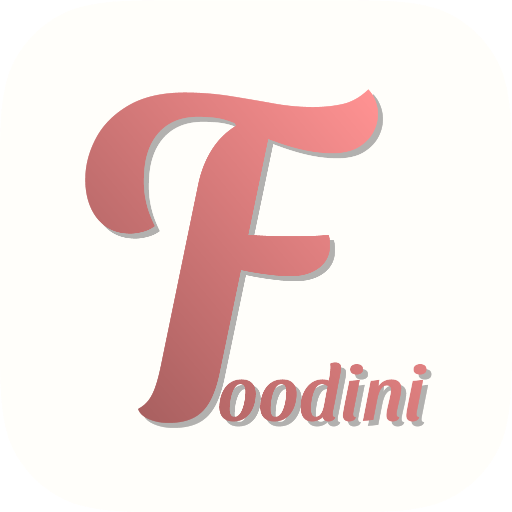

<!-- Improved compatibility of back to top link: See: https://github.com/othneildrew/Best-README-Template/pull/73 -->

<a name="readme-top"></a>

<!--
*** Thanks for checking out the Best-README-Template. If you have a suggestion
*** that would make this better, please fork the repo and create a pull request
*** or simply open an issue with the tag "enhancement".
*** Don't forget to give the project a star!
*** Thanks again! Now go create something AMAZING! :D
-->

<!-- PROJECT SHIELDS -->
<!--
*** I'm using markdown "reference style" links for readability.
*** Reference links are enclosed in brackets [ ] instead of parentheses ( ).
*** See the bottom of this document for the declaration of the reference variables
*** for contributors-url, forks-url, etc. This is an optional, concise syntax you may use.
*** https://www.markdownguide.org/basic-syntax/#reference-style-links
-->

<!-- PROJECT LOGO -->
<br />
<div align="center">
  <a href="https://foodini-react.netlify.app">
    
  </a>

  <h3 align="center">FOODini</h3>

  <p align="center">
    Meal planning app that automates your diet
    <br />
    <a href="https://foodini-react.netlify.app"><strong>DEMO</strong></a>
  </p>
</div>

<!-- TABLE OF CONTENTS -->
<details>
  <summary>Table of Contents</summary>
  <ol>
    <li>
      <a href="#about-the-project">About The Project</a>
      <ul>
        <li><a href="#built-with">Built With</a></li>
      </ul>
    </li>
    <li>
      <a href="#getting-started">Getting Started</a>
      <ul>
        <li><a href="#prerequisites">Prerequisites</a></li>
        <li><a href="#installation">Installation</a></li>
      </ul>
    </li>
	<li><a href="#roadmap">Roadmap</a></li>
	<li><a href="#contact">Contact</a></li>
    <li><a href="#acknowledgments">Acknowledgments</a></li>
  </ol>
</details>

<!-- ABOUT THE PROJECT -->

## About The Project

[![Product Name Screen Shot][product-screenshot]](https://foodini-react.netlify.app)
This application aims to automate every day tasks related to diet making it easier to manage nutrition and reduce food waste. From storage management, product shelf life and recipes, to meal planning and shopping list.

Everything is connected to everything so after the user fills the storage for the first time, if he sticks to his plan, he will never have to do it again. The app will track the ingredients and their shelf life, the shopping list will be generated from the meal plan based on available storage and then with just one click, the user can fill up their storage again.

### Why?

Wasting food in a world where over 800 million people are hungry or undernourished is a serious problem. It is estimated that **33%** of the food produced in the world is wasted. This is **1.3 billion tons** annually.

A staggering part of this problem originates in our homes. The largest portion of wasted food, as much as 60%, comes from households. The cause is very often bad habits or busyness. Neglecting the expiration date, buying too much or unwise, or lack of ideas for using ingredients are some of the most common reasons for throwing food away.

**FOODini** is an idea for a web application that changes the user's shopping habits by automating tasks related to nutrition.

<p align="right">(<a href="#readme-top">back to top</a>)</p>

### Built With

[![JavaScript][]][javascript-url] [![React][react.js]][react-url] [![Xano][]][xano-url]

<p align="right">(<a href="#readme-top">back to top</a>)</p>

<!-- GETTING STARTED -->

## Getting Started

### Prerequisites

1. You need to have Node.js installed on your computer. You can download it [Here](https://nodejs.org/ "Here").

2. Install node package manager:

```sh
npm install npm@latest -g
```

### Installation

1. Clone the repo:
   ```sh
   git clone https://github.com/niziolowski/FOODini-react.git
   ```
2. Install NPM packages:
   ```sh
   npm install
   ```
3. start the developement server:
   ```js
   npm run start
   ```

<p align="right">(<a href="#readme-top">back to top</a>)</p>

<!-- ROADMAP -->

## Roadmap

- [x] Design the UI
- [x] Build a prototype - basic functionality ([demo](http://foodini-dev.netlify.app))
- [x] Create an API server and database
- [ ] Build professional application using React (WIP)
- [ ] Publish the application
- [ ] Add language Support
  - [ ] Polish
  - [ ] English
- [ ] Develop new features:
  - [ ] Recipes database (with sharing capability)
  - [ ] Different diet plan templates (keto,paleo,vegan, etc.)
  - [ ] Calories calculator

<p align="right">(<a href="#readme-top">back to top</a>)</p>

<!-- CONTACT -->

## Contact

Krystian Piątkowski - krystianpiatkowski92@gmail.com
Project Link: https://github.com/niziolowski/FOODini-react

<p align="right">(<a href="#readme-top">back to top</a>)</p>

<!-- ACKNOWLEDGMENTS -->

## Acknowledgments

- [React-hook-form](https://react-hook-form.com/) - great library that saved me a lot of time creating forms
- [React Icons](https://react-icons.github.io/react-icons/search) - easy to use icons
- [Swiper.js](https://swiperjs.com/react) - library for swipe events
- [UUID](https://www.uuidgenerator.net/) - id generator
- [Axios](https://axios-http.com/docs/intro) - Promise based HTTP client

<p align="right">(<a href="#readme-top">back to top</a>)</p>

<!-- MARKDOWN LINKS & IMAGES -->
<!-- https://www.markdownguide.org/basic-syntax/#reference-style-links -->

[contributors-shield]: https://img.shields.io/github/contributors/othneildrew/Best-README-Template.svg?style=for-the-badge
[contributors-url]: https://github.com/othneildrew/Best-README-Template/graphs/contributors
[forks-shield]: https://img.shields.io/github/forks/othneildrew/Best-README-Template.svg?style=for-the-badge
[forks-url]: https://github.com/othneildrew/Best-README-Template/network/members
[stars-shield]: https://img.shields.io/github/stars/othneildrew/Best-README-Template.svg?style=for-the-badge
[stars-url]: https://github.com/othneildrew/Best-README-Template/stargazers
[issues-shield]: https://img.shields.io/github/issues/othneildrew/Best-README-Template.svg?style=for-the-badge
[issues-url]: https://github.com/othneildrew/Best-README-Template/issues
[license-shield]: https://img.shields.io/github/license/othneildrew/Best-README-Template.svg?style=for-the-badge
[license-url]: https://github.com/othneildrew/Best-README-Template/blob/master/LICENSE.txt
[linkedin-shield]: https://img.shields.io/badge/-LinkedIn-black.svg?style=for-the-badge&logo=linkedin&colorB=555
[linkedin-url]: https://linkedin.com/in/othneildrew
[product-screenshot]: images/screenshot.png
[javascript]: https://img.shields.io/badge/JavaScript-000000?style=for-the-badge&logo=javascript&logoColor=yellow
[javascript-url]: https://www.javascript.com/
[xano]: https://img.shields.io/badge/Xano.com-000000?style=for-the-badge&logo=xano.com&logoColor=yellow
[xano-url]: https://www.xano.com/
[next.js]: https://img.shields.io/badge/next.js-000000?style=for-the-badge&logo=nextdotjs&logoColor=white
[next-url]: https://nextjs.org/
[react.js]: https://img.shields.io/badge/React-20232A?style=for-the-badge&logo=react&logoColor=61DAFB
[react-url]: https://reactjs.org/
[vue.js]: https://img.shields.io/badge/Vue.js-35495E?style=for-the-badge&logo=vuedotjs&logoColor=4FC08D
[vue-url]: https://vuejs.org/
[angular.io]: https://img.shields.io/badge/Angular-DD0031?style=for-the-badge&logo=angular&logoColor=white
[angular-url]: https://angular.io/
[svelte.dev]: https://img.shields.io/badge/Svelte-4A4A55?style=for-the-badge&logo=svelte&logoColor=FF3E00
[svelte-url]: https://svelte.dev/
[laravel.com]: https://img.shields.io/badge/Laravel-FF2D20?style=for-the-badge&logo=laravel&logoColor=white
[laravel-url]: https://laravel.com
[bootstrap.com]: https://img.shields.io/badge/Bootstrap-563D7C?style=for-the-badge&logo=bootstrap&logoColor=white
[bootstrap-url]: https://getbootstrap.com
[jquery.com]: https://img.shields.io/badge/jQuery-0769AD?style=for-the-badge&logo=jquery&logoColor=white
[jquery-url]: https://jquery.com
